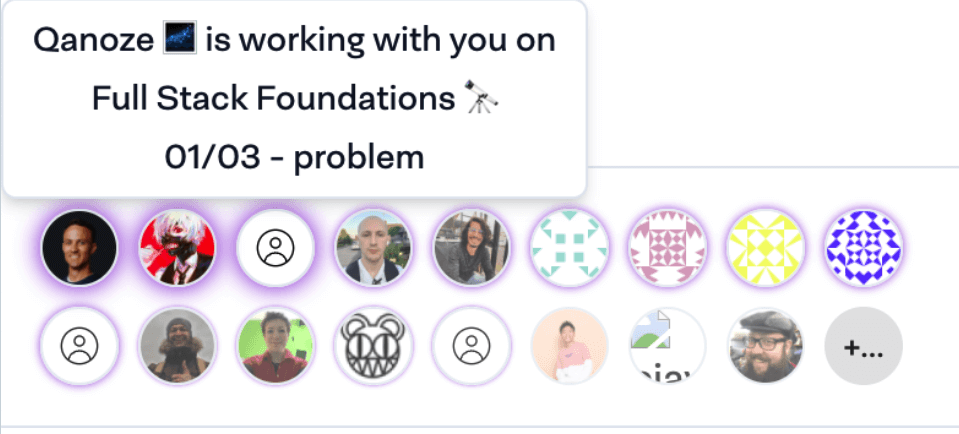

For his new course platform, [Kent C. Dodds](https://twitter.com/kentcdodds) used PartyKit to power the real-time avatars of the users who are currently working through the course. His implementation is open source, and contains considerations for privacy, as well as sorting avatars according to how close they are in their course progress.

## Explore

Explore this example:

- [course platform](https://www.epicweb.dev/)
- [blog post](https://blog.partykit.io/posts/partykit-powers-realtime-avatars-in-epic-web)
- [GitHub repository](https://github.com/epicweb-dev/kcdshop/blob/ab590025aab758a832b98dfd4fc91fab639b4b3a/packages/presence/src/server.ts)
