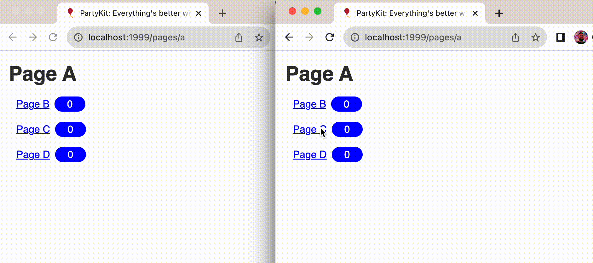

This example shows how many people are currently viewing any of the pages linked from the the current one -- the counter placed near the links increases or decreases as users move around the app. It is a demo of an advanced use of [multi-party communication](https://docs.partykit.io/guides/using-multiple-parties-per-project/).

## Explore

Explore this example:

- [GitHub repository](https://github.com/partykit/example-link-counter)
- [live demo](https://connection-counter.labs.partykit.dev/pages/a)
