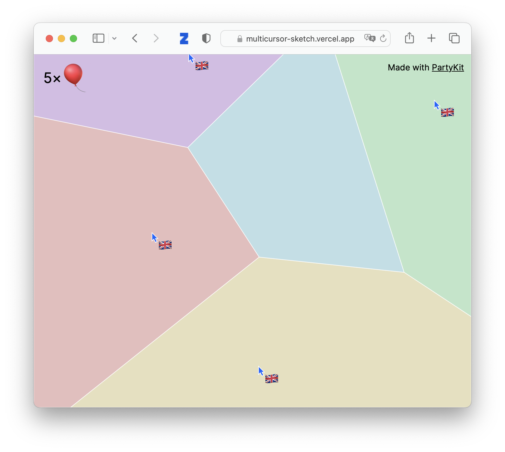

[Matt Webb's](https://twitter.com/genmon) 'Voronoi' app features cursors with country flags on a colorful, ever-changing background. Cursors indicate presence and movement on the demo, which helps your users get a sense that they are together in one room.

## Explore

Explore this example:

- [GitHub repository](https://github.com/partykit/sketch-voronoi)
- [live demo](https://multicursor-sketch.vercel.app/)
- [blog post](https://blog.partykit.io/posts/dancing-cursors-and-voronoi-diagrams)
