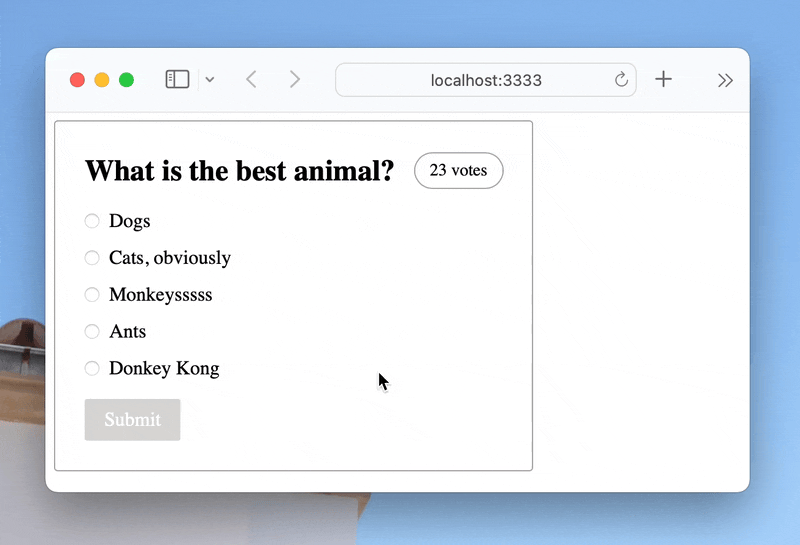

A web component with live polls that respond in real-time to user's choices by [Matt Webb](https://twitter.com/genmon).

## Explore

Explore this example:

- [GitHub repository](https://github.com/partykit/sketch-polls)
- [live demo](https://partykit.github.io/sketch-polls/)
- [blog post](https://blog.partykit.io/posts/live-polls-with-stencil)
