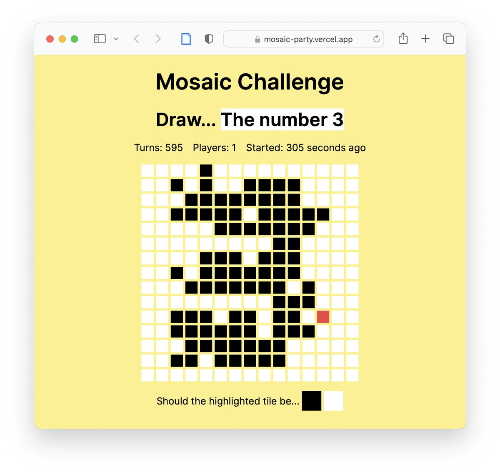

This is a multiplayer drawing challenge web toy from [Matt Webb](https://twitter.com/genmon).

Each turn, a user is asked whether a random tile should be black or white according to a given challenge. All users see the same mosaic, and all users play at the same time. It's fun to see how quickly the image converges... or doesn't.

## Explore

Explore this example:

- [GitHub repository](https://github.com/partykit/sketch-mosaic)
- [live demo](https://mosaic-party.vercel.app/)
- [blog post](https://blog.partykit.io/posts/wisdom-of-crowds)
