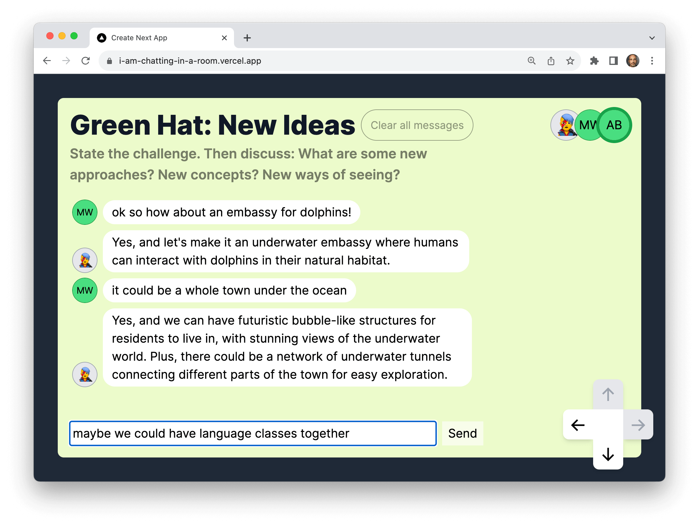

This app features multiplayer chat rooms connected spatially in a simple map, each inhabited by a helpful AI chatbot. It was built by [Matt Webb](https://twitter.com/genmon) using Yjs, PartyKit, and OpenAI.

## Explore

Explore this example:

- [GitHub repository](https://github.com/partykit/sketch-spatial-chat)
- [live demo](https://i-am-chatting-in-a-room.vercel.app/)
- [blog post](https://blog.partykit.io/posts/thinking-hats-and-spatial-chat)
