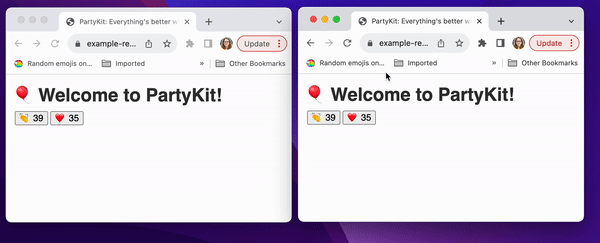

See your friends react in real time. As soon as someone reacts to your content, the counter is updated on all connected clients.

You can **create a new room with its own counter** by appending any room name to the URL. This means that you can easily implement separate counters for any subpage or section (for example, for any blog post or video on your website). Every time you use a new identifier, a new room is automatically created - and every room is its own API, which you can access.

This example contains a barebone HTML page and an SSR version built with Next.js. The server was written to accommodate both approaches.

## Explore

Explore this example:

- [GitHub repository](https://github.com/partykit/example-reactions)
- [live demo](https://example-reactions.labs.partykit.dev)
- [blog post](https://blog.partykit.io/posts/partykit-at-viteconf)
