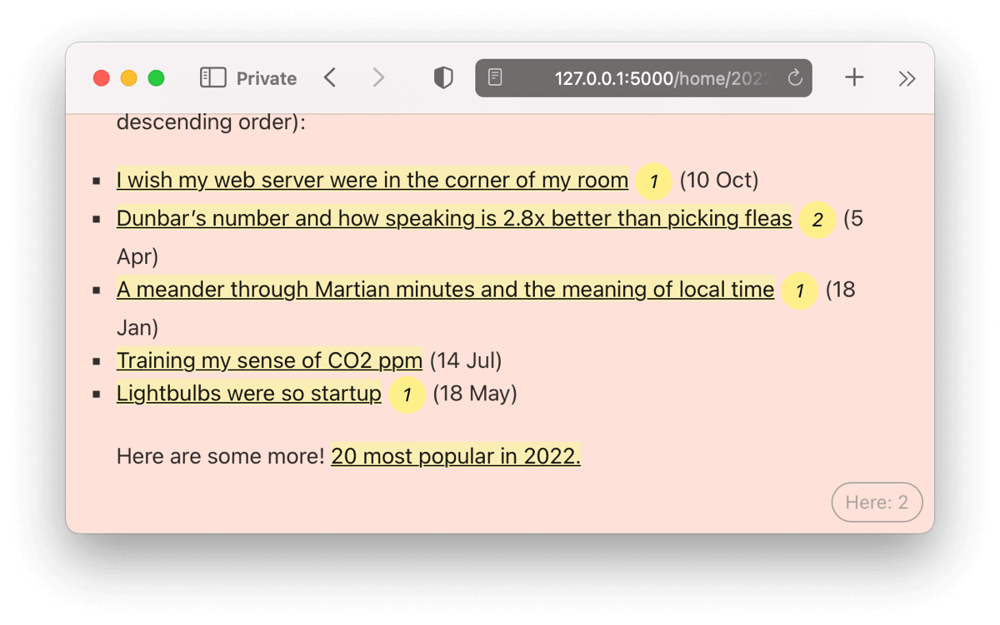

Three web components from [Matt Webb](https://twitter.com/genmon): the first one badges all internal links on a site with how many people are present at the other end.

Another tells you if a hyperlink has been used, in realtime, while you're using the page.

The third adds multiplayer cursors to any webpage, as if the cursors are sitting behind the content, through frosted glass.

## Explore

Explore this example:

- [GitHub repository](https://github.com/partykit/sketch-disco)
