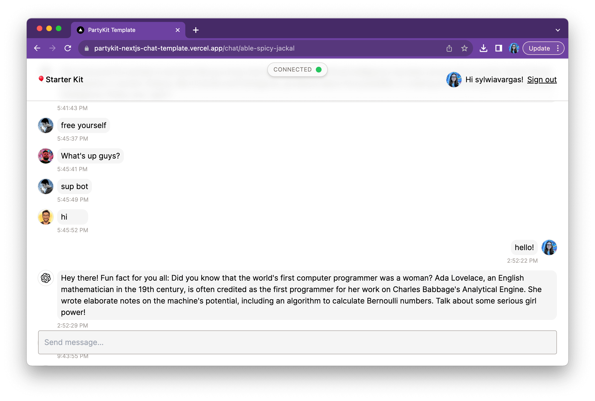
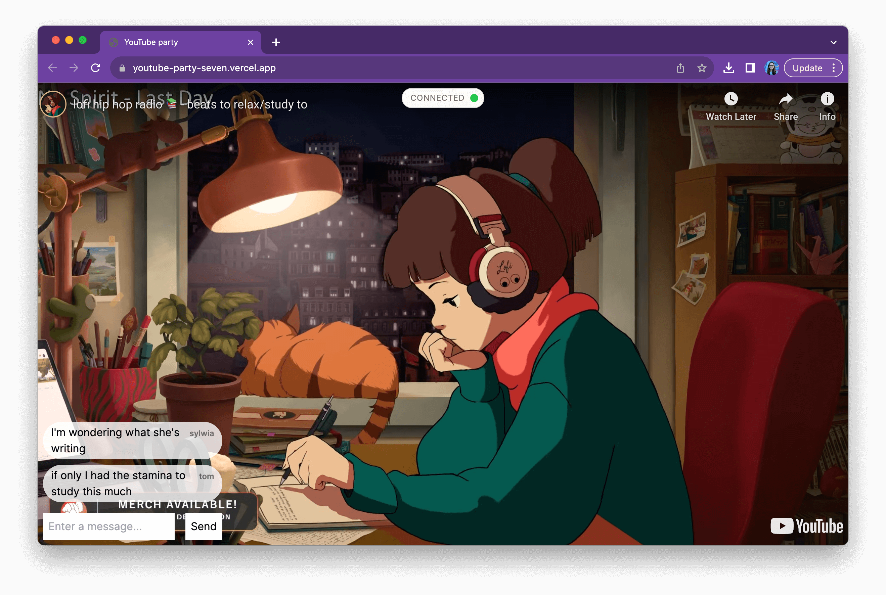

import { Card, CardGrid } from '@astrojs/starlight/components';

Here are examples of apps built with PartyKit.

:::tip[Share your project!]
Are you using PartyKit? We want to hear from you! Share your project with us on [Discord](https://discord.gg/KDZb7J4uxJ) or [Twitter](https://twitter.com/partykit_io)!
:::

## Next.js chat app with user avatars, AI agents, and auth

Our Next.js template features multiple chatrooms with chat history, avatars, and AI NPCs interacting with your users.

🎈 **Explore:** [GitHub repository](https://github.com/partykit/partykit-nextjs-chat-template) | [live demo](https://partykit-nextjs-chat-template.vercel.app/)

## Cursors with country flags

[Matt Webb's](https://twitter.com/genmon) 'Voronoi' app features cursors with country flags on a colorful, ever-changing background. Cursors indicate presence and movement on the demo, which helps your users get a sense that they are together in one room.

🎈 **Explore:** [GitHub repository](https://github.com/partykit/sketch-voronoi) | [live demo](https://multicursor-sketch.vercel.app/)

## Multiplayer text editor

A multiplayer text editor built with PartyKit, Yjs, Tiptap, and Supabase.

🎈 **Explore:** [GitHub repository](https://github.com/partykit/partykit-text-editor-example)

## Live polls

A web component with live polls that respond in real-time to user's choices by [Matt Webb](https://twitter.com/genmon).

🎈 **Explore:** [the GitHub repository](https://github.com/partykit/sketch-polls)

## YouTube watch party

A YouTube watch party with a chat by [Matt Webb](https://twitter.com/genmon). Share the joy of watching your favorite YouTube videos with your friends.

🎈 **Explore:** [the GitHub repository](https://youtube-party-seven.vercel.app/) | [live demo](https://github.com/partykit/sketch-youtube).

## Remix starter

A starter template for Remix and PartyKit.

🎈 **Explore:** [the GitHub repository](https://github.com/partykit/remix-starter)

## Mosaic - realtime collaborative game

This is a multiplayer drawing challenge web toy from [Matt Webb](https://twitter.com/genmon).

Each turn, a user is asked whether a random tile should be black or white according to a given challenge. All users see the same mosaic, and all users play at the same time. It's fun to see how quickly the image converges... or doesn't.

🎈 **Explore:** [the GitHub repository](https://github.com/partykit/sketch-mosaic) | [live demo](https://mosaic-party.vercel.app/)

## Two-way hyperlinks and social webpages

Three web components from [Matt Webb](https://twitter.com/genmon): the first one badges all internal links on a site with how many people are present at the other end. Another tells you if a hyperlink has been used, in realtime, while you're using the page. A third adds multiplayer cursors to any webpage, as if the cursors are sitting behind the content, through frosted glass.

🎈 **Explore:** [the GitHub repository](https://github.com/partykit/sketch-disco)

--- 
:::tip[Share your project!]
Are you using PartyKit? We want to hear from you! Share your project with us on  [Discord](https://discord.gg/KDZb7J4uxJ) or [Twitter](https://twitter.com/partykit_io)!
:::