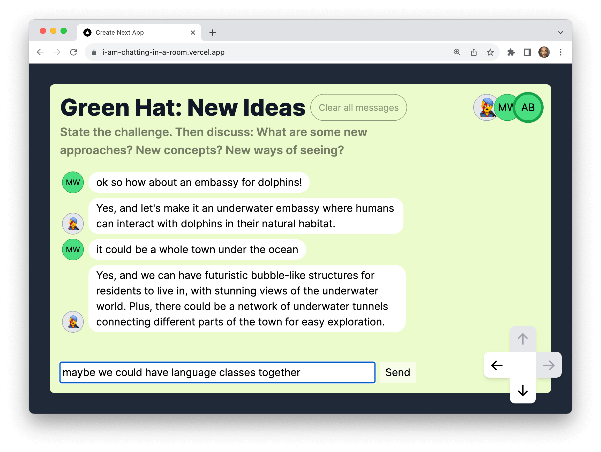
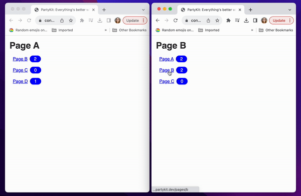
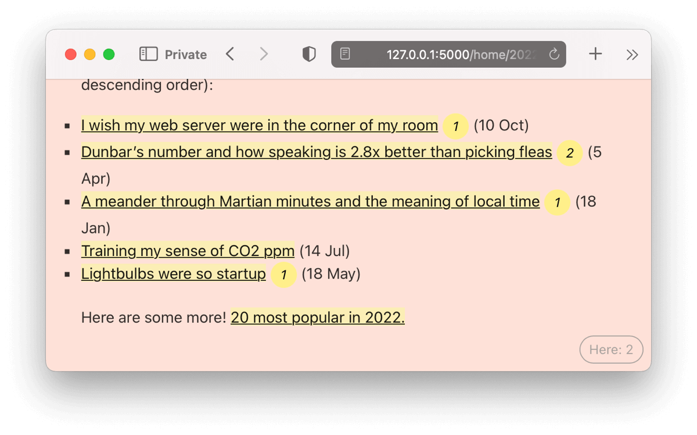

import { Card, CardGrid } from "@astrojs/starlight/components";

Here are examples of apps built with PartyKit.

:::tip[Share your project!]
Are you using PartyKit? We want to hear from you! Share your project with us on [Discord](https://discord.gg/KDZb7J4uxJ) or [Twitter](https://twitter.com/partykit_io)!
::: 

## Realtime Reaction Counters

See your friends react in real time. As soon as someone reacts to your content, the counter is updated on all connected clients. You can **create a new room with its own counter** by appending any room name to the URL. This means that you can easily implement separate counters for any subpage or section (for example, for any blog post or video on your website). Every time you use a new identifier, a new room is automatically created - and every room is its own API, which you can access.

This example contains a barebones HTML page and an SSR version built with Next.js. The server was written to accommodate both approaches.

🎈 **Explore:** [GitHub repository](https://github.com/partykit/example-reactions) | [live demo](https://example-reactions.jevakallio.partykit.dev/) | [blog post](https://blog.partykit.io/posts/partykit-at-viteconf)

## Cursors with country flags

[Matt Webb's](https://twitter.com/genmon) 'Voronoi' app features cursors with country flags on a colorful, ever-changing background. Cursors indicate presence and movement on the demo, which helps your users get a sense that they are together in one room.

🎈 **Explore:** [GitHub repository](https://github.com/partykit/sketch-voronoi) | [live demo](https://multicursor-sketch.vercel.app/) | [blog post](https://blog.partykit.io/posts/dancing-cursors-and-voronoi-diagrams)

## Multiplayer AI chat rooms

This app features multiplayer chat rooms connected spatially in a simple map, each inhabited by a helpful AI chatbot. It was built by [Matt Webb](https://twitter.com/genmon) using Yjs, PartyKit, and OpenAI.

🎈 **Explore:** [GitHub repository](https://github.com/partykit/sketch-spatial-chat) | [live demo](https://i-am-chatting-in-a-room.vercel.app/) | [blog post](https://blog.partykit.io/posts/thinking-hats-and-spatial-chat)

## Connection Counter

This example shows how many people are currently viewing any of the pages linked from the the current one - the counter placed near the links increases or decreases as users move around the app. It is a demo of an advanced use of [multi-party communication](https://docs.partykit.io/guides/using-multiple-parties-per-project/).

🎈 **Explore:** [GitHub repository](https://github.com/partykit/example-link-counter) | [live demo](https://connection-counter.jevakallio.partykit.dev/pages/a)

## Next.js chat app with user avatars, AI agents, and auth

Our Next.js template features multiple chatrooms with chat history, avatars, and AI NPCs interacting with your users.

🎈 **Explore:** [GitHub repository](https://github.com/partykit/partykit-nextjs-chat-template) | [live demo](https://partykit-nextjs-chat-template.vercel.app/)

## Multiplayer text editor

A multiplayer text editor built with PartyKit, Yjs, Tiptap, and Supabase.

🎈 **Explore:** [GitHub repository](https://github.com/partykit/partykit-text-editor-example)

## Live polls

A web component with live polls that respond in real-time to user's choices by [Matt Webb](https://twitter.com/genmon).

🎈 **Explore:** [GitHub repository](https://github.com/partykit/sketch-polls) | [live demo](https://partykit.github.io/sketch-polls/) | [blog post](https://blog.partykit.io/posts/live-polls-with-stencil)

## YouTube watch party

A YouTube watch party with a chat by [Matt Webb](https://twitter.com/genmon). Share the joy of watching your favorite YouTube videos with your friends.

🎈 **Explore:** [GitHub repository](https://github.com/partykit/sketch-youtube) | [live demo](https://youtube-party-seven.vercel.app/)

## The Namib Desert watering hole livestream

This Remix app features a livestream from the Namib Desert with an ephemeral chat window. Built by [Matt Webb](https://twitter.com/genmon).

🎈 **Explore:** [GitHub repository](https://github.com/partykit/sketch-waterhole) | [live demo](https://waterhole.genmon.partykit.dev/) | [blog post ](https://blog.partykit.io/posts/single-serving-waterhole)

## Remix starter

A starter template for Remix and PartyKit.

🎈 **Explore:** [GitHub repository](https://github.com/partykit/remix-starter)

## TinyBase starter

A community starter template for a local-first data store app. Built with TinyBase, TypeScript, React, and PartyKit by [James Pearce](https://twitter.com/jamespearce).

🎈 **Explore:** [GitHub repository](https://github.com/tinyplex/tinybase-ts-react-partykit)

## Replicache starter

A community starter template for a local-first chat app. Built with Replicache and PartyKit by [Alex Anderson](https://twitter.com/ralex1993),

🎈 **Explore:** [GitHub repository](https://github.com/alexanderson1993/partykit-replicache)

## Game starter

A community starter template for turn-based multiplayer games with Next.js, Redux, and PartyKit by [Swen Mulderij](https://twitter.com/Swendude).

🎈 **Explore:** [GitHub repository](https://github.com/Swendude/partykit-starter)

## Mosaic - realtime collaborative game

This is a multiplayer drawing challenge web toy from [Matt Webb](https://twitter.com/genmon).

Each turn, a user is asked whether a random tile should be black or white according to a given challenge. All users see the same mosaic, and all users play at the same time. It's fun to see how quickly the image converges... or doesn't.

🎈 **Explore:** [GitHub repository](https://github.com/partykit/sketch-mosaic) | [live demo](https://mosaic-party.vercel.app/) | [blog post](https://blog.partykit.io/posts/wisdom-of-crowds)

## Two-way hyperlinks and social webpages

Three web components from [Matt Webb](https://twitter.com/genmon): the first one badges all internal links on a site with how many people are present at the other end. Another tells you if a hyperlink has been used, in realtime, while you're using the page. A third adds multiplayer cursors to any webpage, as if the cursors are sitting behind the content, through frosted glass.

🎈 **Explore:** [GitHub repository](https://github.com/partykit/sketch-disco)

---

:::tip[Share your project!]
Are you using PartyKit? We want to hear from you! Share your project with us on [Discord](https://discord.gg/KDZb7J4uxJ) or [Twitter](https://twitter.com/partykit_io)!
:::
