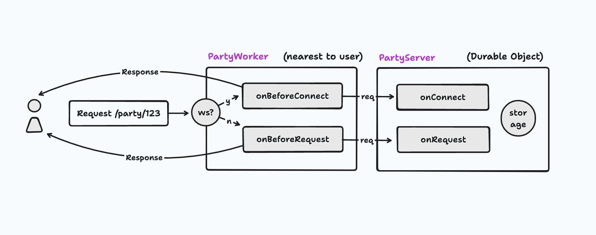

When your PartyKit project is deployed, the server accepts HTTP requests and WebSocket connections from the Internet.

In order to prevent unauthorized requests being routed to your server, you can implement authentication in your `onBeforeConnect` and `onBeforeRequest` handlers.

<!-- TODO: Better image design -->



:::note[About the example code]

This guide demonstrates authentication using [JSON Web Tokens](https://jwt.io/) (JWTs) with the [Clerk](https://clerk.dev/) authentication service. The same approach will work for any JWT library, and can be adapted to different secret- and session-based authentication methods.
:::

### Authenticating WebSocket connections

Every PartyKit server accepts WebSocket connections by default.

To ensure that only authorized users can connect to your server, you should pass a session token to the initial connection request. The most convenient way to do this is to pass the token as a query string parameter:

```ts
const partySocket = new PartySocket({
  host: PARTYKIT_HOST,
  room: "room-id",
  // attach the token to PartyKit in the query string
  query: async () => ({
    // get an auth token using your authentication client library
    token: await getToken()
  })
});
```

The `query` parameter can be an object of key-value pairs, or an (optionally) asynchronous
function that returns one.

You can then verify your user's identity in a `static onBeforeConnect` method:

```ts
import * as Party from "partykit/server";
import { verifyToken } from "@clerk/backend";

const DEFAULT_CLERK_ENDPOINT = "https://clerk.yourdomain.com";

export default class Server implements Party.Server {
  static async onBeforeConnect(request: Party.Request, lobby: Party.Lobby) {
    try {
      // get authentication server url from environment variables (optional)
      const issuer = lobby.env.CLERK_ENDPOINT || DEFAULT_CLERK_ENDPOINT;
      // get token from request query string
      const token = new URL(request.url).searchParams.get("token") ?? "";
      // verify the JWT (in this case using clerk)
      const session = await verifyToken(token, { issuer });
      // pass any information to the onConnect handler in headers (optional)
      request.headers.set("X-User-ID", session.sub);
      // forward the request onwards on onConnect
      return request;
    } catch (e) {
      // authentication failed!
      // short-circuit the request before it's forwarded to the party
      return new Response("Unauthorized", { status: 401 });
    }
  }

  onConnect(
    connection: Party.Connection,
    { request }: Party.ConnectionContext
  ) {
    const userId = request.headers.get("X-User-ID");
    connection.send(`Hello ${userId} from party!`);
  }
}
```

### Authenticating HTTP requests

<!-- TODO: Add links to guide/API-->

You can configure your PartyKit server to [respond to HTTP requests](/guides/responding-to-http-requests).

To ensure that only authorized users can make requests to your server, you should send a session token in the request.

The recommended way is to pass it as an `Authorization` header:

```ts
fetch(`https://${PARTYKIT_HOST}/party/${roomId}`, {
  headers: {
    // get an auth token using your authentication client library
    Authorization: getToken()
  }
});
```

You can then verify your user's identity in a `static onBeforeRequest` method:

```ts
import type * as Party from "partykit/server";
import { verifyToken } from "@clerk/backend";

const DEFAULT_CLERK_ENDPOINT = "https://clerk.yourdomain.com";

export default class Server implements Party.Server {
  static async onBeforeRequest(request: Party.Request) {
    try {
      // get authentication server url from environment variables (optional)
      const issuer = lobby.env.CLERK_ENDPOINT || DEFAULT_CLERK_ENDPOINT;
      // get token from request headers
      const token = request.headers.get("Authorization") ?? "";
      // verify the JWT (in this case using clerk)
      await verifyToken(token, { issuer });
      // forward the request onwards on onRequest
      return request;
    } catch (e) {
      // authentication failed!
      // short-circuit the request before it's forwarded to the party
      return new Response("Unauthorized", { status: 401 });
    }
  }

  onRequest(req: Party.Request) {
    return new Response(`Hello from party!`);
  }
}
```

### Other authentication methods

The above examples use Clerk for brevity, but you can use any authentication provider.

If you're rolling your own JWT authentication, or your identity provider doesn't supply an SDK that's compatible with PartyKit's Cloudflare Workers runtime, you can verify and decode your JWTs with the [`cloudflare-worker-jwt`](https://github.com/tsndr/cloudflare-worker-jwt) package.

Alternatively, you can consider these authentication methods:

- For server-to-server communication, you can use a shared secret. Read about [managing environment variables with PartyKit](/guides/managing-environment-variables).

- For client-to-server connections, you can pass any type of session token, and verify it against your session service. For an example with [NextAuth.js](https://next-auth.js.org/), see the [PartyKit Next.js example app](/examples/app-examples/chat-app-with-ai-and-auth).
