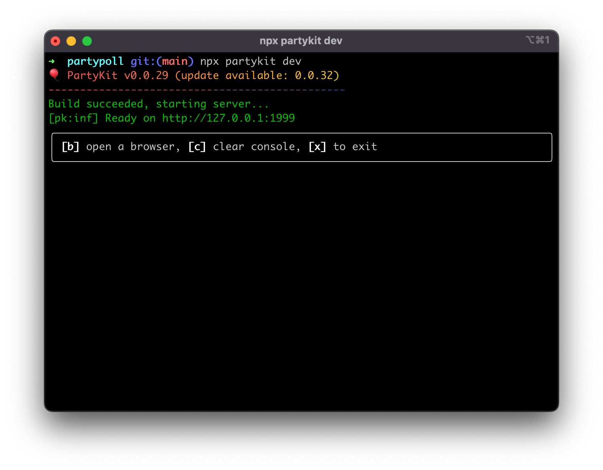

In this step you will set up your PartyKit server to handle HTTP requests.

## Install PartyKit

To add PartyKit to a new app, run the following command in the terminal in your app directory:

```bash
npx partykit@latest init
```

This command adds three things:

1. the `partykit` package, which enables building and deploying realtime servers,
2. the `partysocket` package, which provides a WebSocket client that will automatically reconnect if the connection is dropped,
3. a new directory called `party` where your server code will live.

## Run dev servers

In the previous step you started the Next.js dev server. Now open an additional tab in your terminal and run PartyKit dev server:

```bash
npx partykit dev
```

If it works correctly, you should see an output similar to the following:



## Set up the server

Navigate to the `index.ts` file in the `party` directory. This is the server template that was created for you when you initialized PartyKit. Replace the code with the following:

```ts
import type * as Party from "partykit/server";

import type { Poll } from "@/app/types";

export default class Server implements Party.Server {
  constructor(readonly room: Party.Room) {}

  poll: Poll | undefined;

  async onRequest(req: Party.Request) {
    if (req.method === "POST") {
      const poll = (await req.json()) as Poll;
      this.poll = { ...poll, votes: poll.options.map(() => 0) };
    }

    if (this.poll) {
      return new Response(JSON.stringify(this.poll), {
        status: 200,
        headers: { "Content-Type": "application/json" }
      });
    }

    return new Response("Not found", { status: 404 });
  }
}

Server satisfies Party.Worker;
```

Let's go over this code.

Since each poll will be its own room, you can keep our poll data in-memory. You can also use the TypeScript types from our Next.js app:

```ts
poll: Poll | undefined;
```

Next is the `onRequest` method, which receives a regular HTTP request:

```ts
if (req.method === "POST") {
  const poll = (await req.json()) as Poll;
  this.poll = { ...poll, votes: poll.options.map(() => 0) };
}

if (this.poll) {
  return new Response(JSON.stringify(this.poll), {
    status: 200,
    headers: { "Content-Type": "application/json" },
  });
}
```

We will create the poll in a Next.js server action, and we cannot make a WebSocket connection from the server component. Fortunately, PartyKit accepts also HTTP requests. When a user creates a poll, the _submit_ button will send a `POST` request to the PartyKit server and a new poll will be created.

Finally, if the poll exists, the method will return its data; otherwise, it will error out:

```ts
return new Response("Not found", { status: 404 });
```

## Next steps

With the PartyKit server ready to receive messages, you can now [connect it to the UI](/tutorials/add-partykit-to-a-nextjs-app/3-hook-up-data-to-the-server).

🎈 If you'd like to check how your code compares to the finished app, check <a href="https://github.com/partykit/partypoll/blob/main/party/index.ts#L1-L25" target="_blank" rel="noopener noreferrer">the finished code</a> online 🎈
