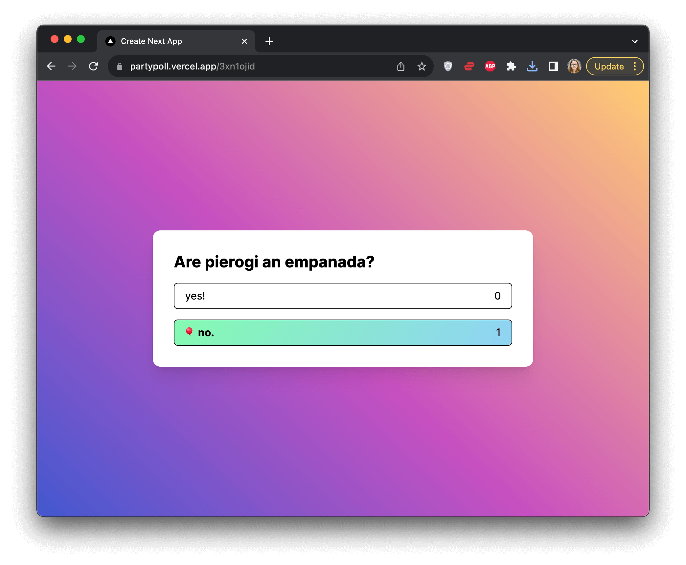

In this tutorial, you'll add a real-time feature to a Next.js app. To get a feel of the app, you can play with the <a href="https://partypoll.vercel.app/" target="_blank" rel="noopener noreferrer">live demo</a>.

Here's the poll app with two pages. The first page lets you create a poll.

And the second page that features the new poll which you can now share with your friends.

## How does the real-time feature work here?

When the user submits the form, two things will happen.

First, an HTTP request will be made to PartyKit to create a new PartyKit room, which will be used by the new poll.

Secondly, the form will redirect to the poll page, and a new WebSocket connection will start to the PartyKit room.

As soon as the poll is created, its link is shareable. When new users visit the page, they will also establish a WebSocket connection and their votes will broadcast in real time to others.

## Get started

To get started, clone the <a href="https://github.com/partykit/tutorial-starter-partypoll" target="_blank" rel="noopener noreferrer">the barebone app code</a> and follow these steps:

1. Run `npm install` inside the project repository
2. Run `npm run dev`
3. Open `http://localhost:3000/` in your browser
4. Whenever you change and save the files, the page will automatically reload

## Next steps

You're now ready to begin your adventure with PartyKit. You will first [set up the PartyKit server](/tutorials/add-partykit-to-a-nextjs-app/2-set-up-server/).

:::tip[Finished code]
We prepared <a href="https://github.com/partykit/partypoll" target="_blank" rel="noopener noreferrer">a separate repository</a> with the finished code so you can compare your code to the end result of this tutorial at any point.
:::

As you progress through the tutorial, you will see links to online files, which will have specific lines highlighted to make it easier to find the changes. Checking the files can be helpful if you're unsure of your code.
